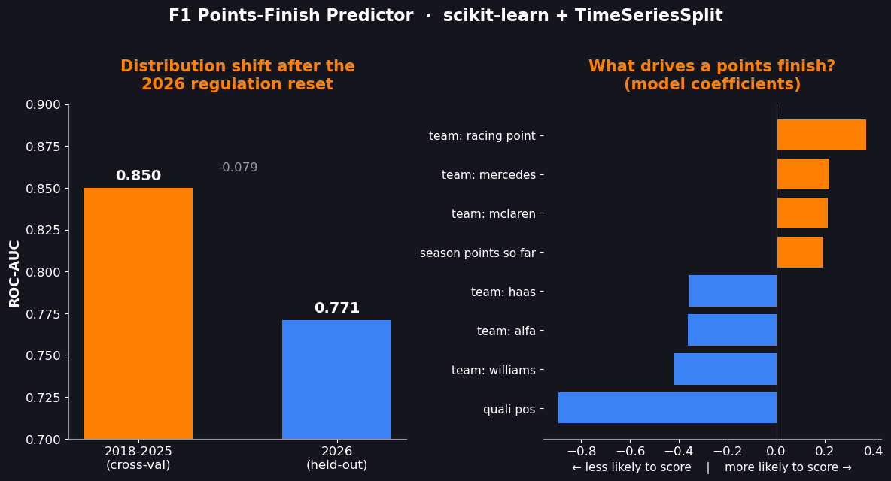
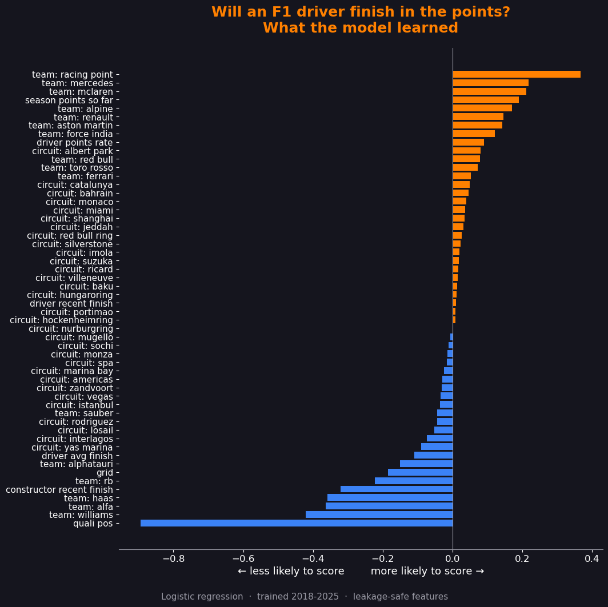

# 🏎️ F1 Points-Finish Predictor

Predicting whether a Formula 1 driver will **finish in the points (top 10)**
in a given race — a binary classification project built with a focus on
**leakage-safe, time-aware machine learning**.

> Trained on 2018–2025, evaluated on the 2026 season to study how a major
> **regulation reset** affects model performance (concept drift).

[**▶ Live demo**](https://f1-points-predictor-iq5km2fmjbqvkjbkxrn3pe.streamlit.app) · [**Results**](#results)

---

## Why this project

Most ML tutorials shuffle their data randomly. Real-world sequential data —
like F1 race results — **cannot** be shuffled: you predict the *next* race
using only *past* races. This project is built around that constraint:

- **No data leakage** — every form feature uses only races that happened
  *before* the race being predicted (`.shift(1)` + expanding/rolling windows).
- **Time-aware validation** — `TimeSeriesSplit` instead of random `KFold`,
  so the model is always validated on races that come *after* its training
  races.
- **Distribution-shift analysis** — 2026's new engine/chassis regulations
  reshuffle the competitive order, letting us measure how a model degrades
  when the world changes underneath it.

---

## The data

Real data comes from the [Jolpica API](https://github.com/jolpica/jolpica-f1)
(the free successor to the deprecated Ergast API), covering 2018–2026.
Each row is **one driver in one race**.

A synthetic generator (`src/make_synthetic.py`) mirrors the exact schema —
including a simulated 2026 regulation reset — so the full pipeline can be
developed and tested offline.

---

## Features (all leakage-safe)

| Feature | Description | Why it's safe |
|---|---|---|
| `grid` | Starting grid position | Set on Saturday, before the race |
| `quali_pos` | Qualifying position | Known before the race |
| `driver_avg_finish` | Career-to-date average finish | Expanding mean, shifted |
| `driver_recent_finish` | Avg finish, last 3 races | Rolling mean, shifted |
| `driver_points_rate` | % of past races in the points | Expanding mean, shifted |
| `constructor_recent_finish` | Team's recent form | Rolling mean, shifted |
| `season_points_so_far` | Championship points before this race | Cumulative, shifted |
| `constructorId`, `circuitId` | Team & circuit | Categorical, known in advance |

---

## Pipeline

```
ColumnTransformer
├── numeric:    SimpleImputer(median) → StandardScaler
└── categorical: SimpleImputer(mode)  → OneHotEncoder
                          │
                          ▼
              LogisticRegression (class_weight="balanced")
```

Everything lives inside one scikit-learn `Pipeline`, so preprocessing is
re-fit on each CV fold's training data only — structurally preventing leakage.

---

## Results



**Model comparison** (TimeSeriesSplit CV, ROC-AUC on 2018–2025):

| Model | CV ROC-AUC |
|---|---|
| **Logistic Regression** | **0.853** |
| Random Forest | 0.852 |
| Gradient Boosting | 0.847 |

Logistic regression edged out the tree ensembles by a hair — the signal is
largely linear, so the **simplest, most interpretable model was chosen**.
(The near-tie with Random Forest is itself a useful finding: added model
complexity bought essentially nothing here.)

**Distribution shift (2026 regulation reset):**

| Metric | 2018–2025 (CV) | 2026 (held-out) |
|---|---|---|
| ROC-AUC | 0.850 | 0.771 |

An 8-point ROC-AUC drop. The 2026 technical regulation reset reshuffled the
competitive order, breaking the feature→outcome relationships the model had
learned on the stable era — a concrete, quantified case of **concept drift**.

**What drives a points finish?** (standardized coefficients)



Qualifying position dominates by a wide margin — track position is king,
exactly as F1 intuition predicts. (Because `quali_pos` and `grid` are highly
correlated, the model leans on qualifying and the standalone `grid`
contribution shrinks — a textbook multicollinearity effect.)

---

## Run it yourself

```bash
# 1. Install dependencies
pip install -r requirements.txt

# 2. Generate data (synthetic, for offline dev)
python src/make_synthetic.py
#    OR fetch real data from the Jolpica API:
#    python src/fetch_data.py --start 2018 --end 2026

# 3. Cross-validate the pipeline (TimeSeriesSplit)
python src/train.py

# 4. Tune & compare models (GridSearchCV)
python src/tune.py

# 5. Final evaluation on 2026 + save model
python src/evaluate.py

# 6. Launch the interactive app
streamlit run app.py
```

---

## Project structure

```
f1-points-predictor/
├── assets/            # result charts
├── data/              # f1_raw.csv
├── models/            # saved model.joblib
├── src/
│   ├── fetch_data.py      # real Jolpica API fetcher
│   ├── make_synthetic.py  # synthetic data (matches real schema)
│   ├── features.py        # leakage-safe feature engineering
│   ├── train.py           # Pipeline + TimeSeriesSplit CV
│   ├── tune.py            # GridSearchCV model comparison
│   └── evaluate.py        # held-out 2026 eval + distribution shift
├── app.py             # Streamlit demo
├── make_post_image.py # generates the result charts
└── requirements.txt
```

## Key ML concepts demonstrated

- scikit-learn **Pipelines** & **ColumnTransformer**
- **TimeSeriesSplit** cross-validation (vs. naive KFold)
- **GridSearchCV** hyperparameter tuning & model selection
- Imbalanced-classification **metrics**: precision, recall, F1, ROC-AUC
- **Threshold analysis** (precision/recall trade-off)
- **Data-leakage prevention** in temporal data
- **Concept drift** / distribution-shift analysis

---

*Built as a portfolio project exploring ML engineering practices in a
motorsport context.*
